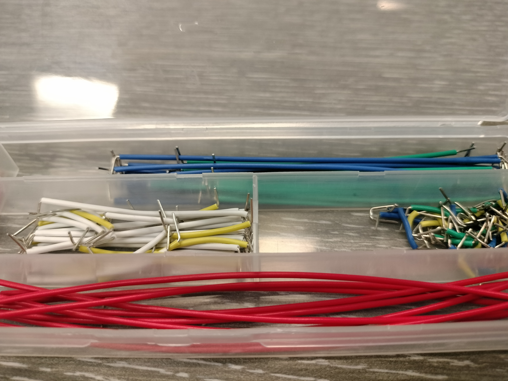
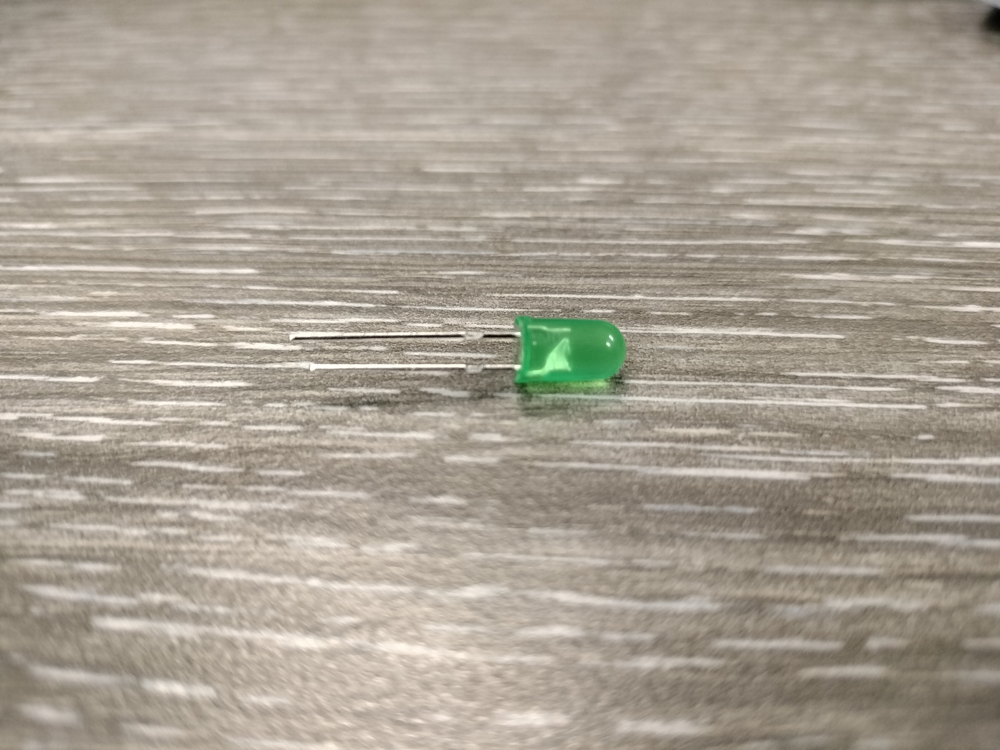
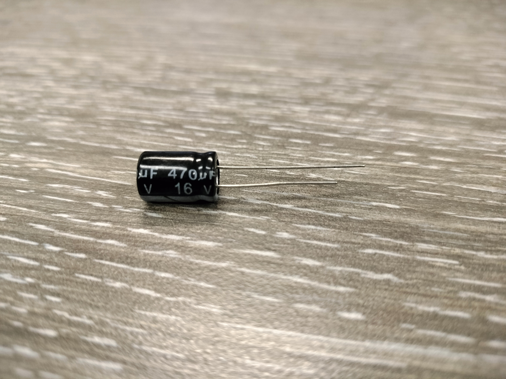
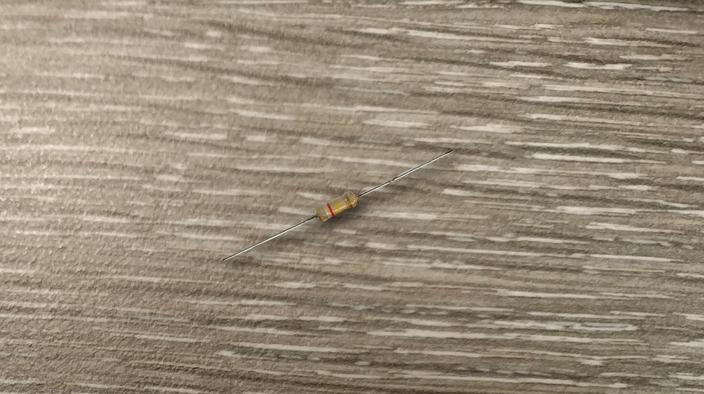
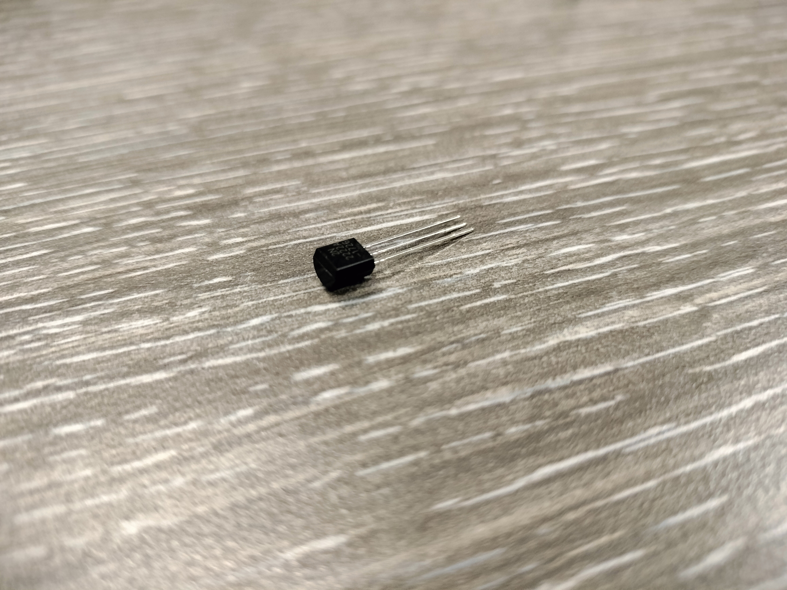
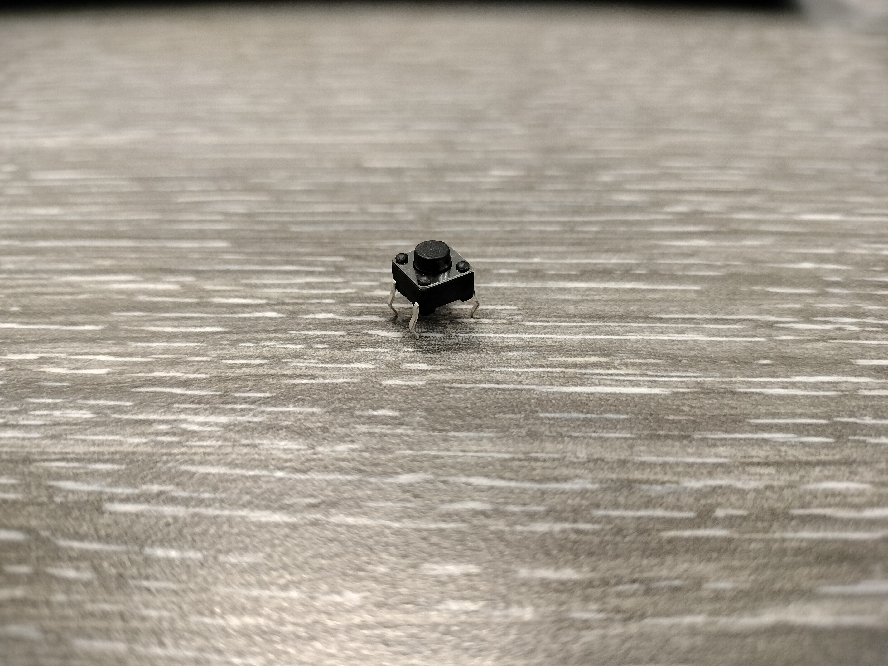
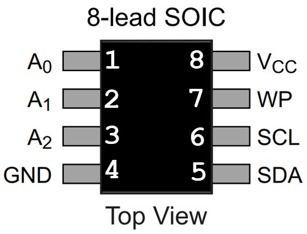

> Photo by [CyberElites]()

When it comes to circuitry, there are usually two main types. One is computer circuitry and the other is electrical circuitry. Both have similar and different properties but work based on the conductive properties of electricity!

Electronic circuitry is composed of individual electrical components such as resistors, transistors, capacitors, inductors and diodes connected by conductive wires or traces through which electric current can flow.

In this blog, we'll be covering these main electric circuitry components:
1. Breadboard
2. Main Interface/Battery
3. Dupont (Jumper) Wire
4. Light-Emitting Diode (**LED**) Light
5. Capacitor
6. Resistor
7. Transistor
8. Switch
9. Electrically Erasable Programmable Read-only Memory(**EEPROM**)/Microprocessor

## Breadboard

A breadboard is for building electrical circuits. It allows you to place components and connections on the board to make circuits without soldering. The holes in the breadboard take care of your connections by physically holding onto parts or wires where you put them and electrically connecting them inside the board. Breadboards have both a positive and negative charge on each side.

### Capture

## Main Interface/Battery

Depending on whether you're using an interface or a battery to charge the breadboard, they both have different implications. With a battery, you have simple functionalities such as a positive terminal (indicated by a bulge sticking upwards) and a negative terminal (no bulge and a slight indentation).

With a powering interface, you have three main components. The first is the On/Off switch, which determines powering the interface or not. The second is a power source port, such as for USB, usually type B or C, or a DC charging port. The third component is the pins with the interface. These pins allow you to provide power, either in 3.3 or 5 voltage, to the breadboard or to other devices that can receive power from pins.

### Capture

## Dupont (Jumper) Wire

A jumper wire is an electric wire that connects remote electric circuits used for printed circuit boards. By attaching a jumper wire on the circuit, it can be short-circuited and short-cut (jump) to the electric circuit.

### Capture

## Light-Emitting Diode Light

A light-emitting diode (LED) is a semiconductor device that emits light when current flows through it. Electrons in the semiconductor recombine with electron holes, releasing energy in the form of photons. The “brightness” of the light is determined by the energy required for electrons to cross the band gap of the semiconductor.

### Capture

## Capacitor

In electrical engineering, a capacitor is a device that stores electrical energy by accumulating electric charges on two closely spaced surfaces that are insulated from each other. It is a passive electronic component with two terminals.

### Capture

## Resistor

A resistor is a passive two-terminal electrical component that implements electrical resistance as a circuit element. In electronic circuits, resistors are used to reduce current flow, adjust signal levels, to divide voltages, bias active elements, and terminate transmission lines, among other uses.

### Capture

## Transistor

A transistor is a semiconductor device used to amplify or switch electrical signals and power. It is one of the basic building blocks of modern electronics. It is composed of semiconductor material, usually with at least three terminals for connection to an electronic circuit.

### Capture

## Switch

Breadboard switches are used to connect or disconnect a power connection in a wire. They are useful for the user to control the power’s flow. Depending on your switch, the power manipulation may vary; however, in the switch image below, the power's flow is dictated by which pin is adjacent on the same side of the switch. For instance, if the pin on the bottom right is being powered, then the output of power is the pin on the bottom left.

### Capture

## EEPROM/Microprocessor

Electrically Erasable Programmable Read-only Memory (EEPROM) is a type of non-volatile memory. It is used in computers, usually integrated in microcontrollers such as smart cards and remote keyless systems, or as a separate chip device, to store relatively small amounts of data by allowing individual bytes to be erased and reprogrammed.

Now, with a EEPROM microprocessor, each pin on a eight pin processor has different functionalities for an electrical circuit, however, discussing these pin's functionalities is out of scope of this blog. More information can be found online or you can wait until next week when the cybersecurity club starts extracting firmware from hardware. When we do this, our next post will go over the specifications of these pins as well some hardware hacking techniques we used. Stay tuned and subscribed for more! 

### Capture

Now that you understand the different kinds of components for electrical circuitry, do you think you could make your own breadboard using these parts? You can order a basic tool kit for these kinds of projects with this link [here!](https://www.amazon.com/ELEGOO-Electronics-Potentiometer-tie-Points-Breadboard/dp/B09YRJQRFF/ref=sr_1_1_sspa?dib=eyJ2IjoiMSJ9.DdJjDkyEnOjQaaAj5ktxWHxWlvPTX9GQMCMkxJWPgbZW62P17WHTBEL56oFky2B8RQcQDfiUbVHaUBbmDHjd6kWfpEkWjkLwU3dhXczsDoytXO8eVlFttTCA2Kj33UGoExVySSCkzTd8RHqRcZIXRay5tYoUDGQ90yhVVkhWMX1EFQEOzK2sOqGQviJf7s_nKW1tV-WyccxrMha7_LSy0HafpLMwmnz6WZuMsXFJyuc.be7FowhtyA6tGiwlk6wyuqrTD8PyPT3Pl25qL-SiyGg&dib_tag=se&keywords=breadboard%2Bkit&qid=1708845526&sr=8-1-spons&sp_csd=d2lkZ2V0TmFtZT1zcF9hdGY&th=1)

---

*If you like these posts, please consider sharing and subscribing to our emailing service!*