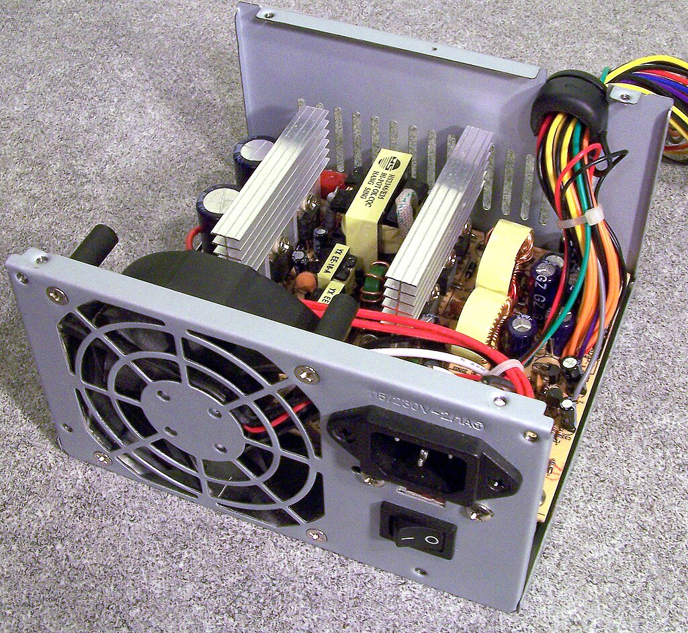
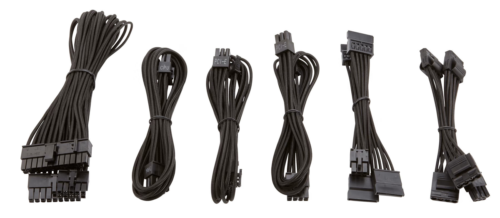
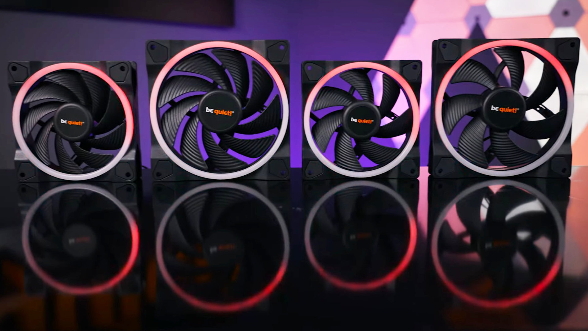
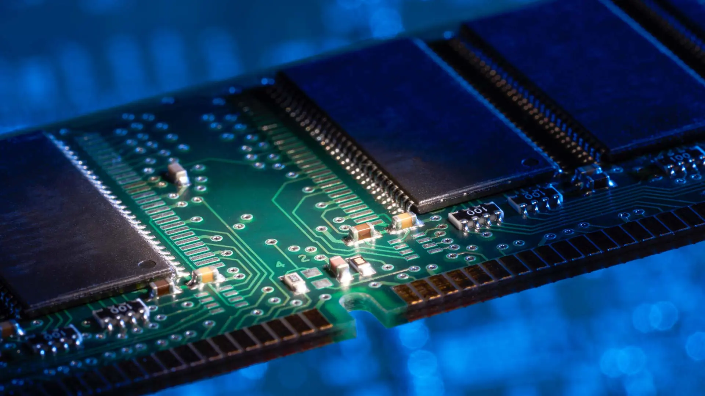
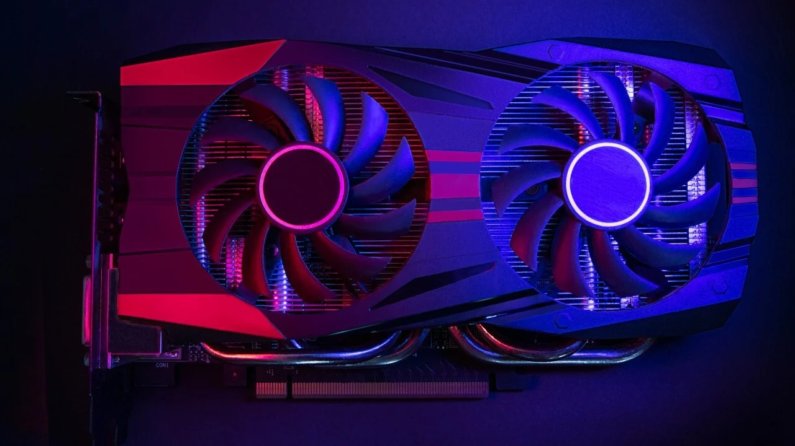
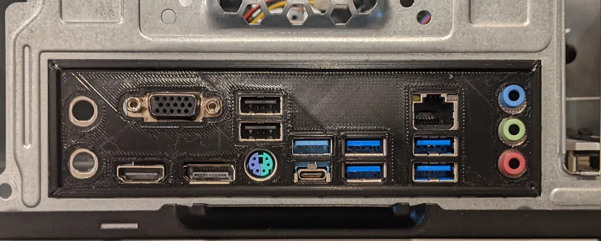
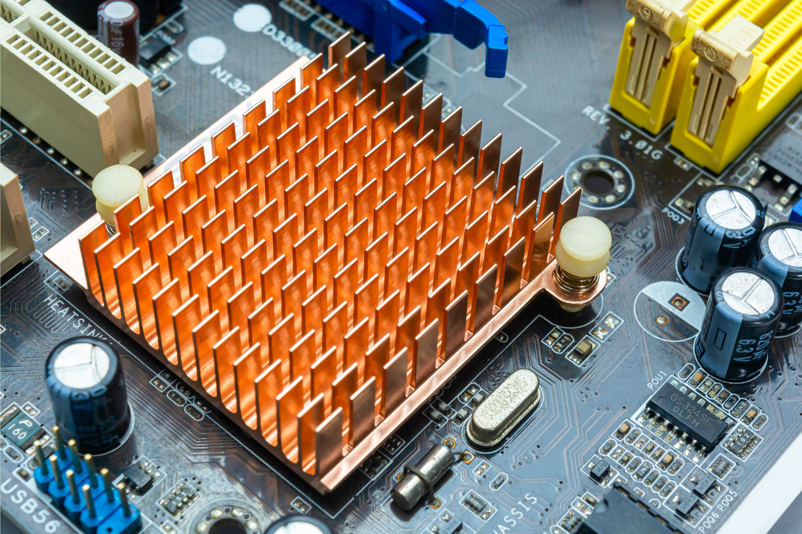
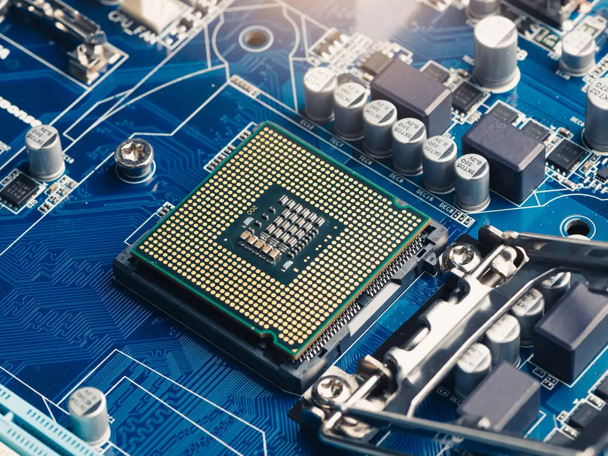

> Photo by [Excelsior University](https://www.excelsior.edu/article/career-spotlight-computer-hardware-engineer/)

Have you ever wondered how the internal of you computer works? What makes it tick and function to do your daily tasks? 

In this blog, we will decipher the different components that makeup a personal computer, as well as, how each component functions and how each piece of hardware depends on each other.

## What is Hardware?

Hardware are the physical makeup components that make a computer function. Such components include:
1. Personal Computer (**PC**) Case
2. Power Supply Unit (**PSU**)
3. Computer Cables (SATA, Molex, PCI/PCIe)
4. Computer Fans
5. Motherboard
6. Random Access Memory (**RAM**)
7. Graphical Processing Unit (**GPU**)
8. Input/Output (**IO**) Shield with Connections
9. Heatsink
10. Central Processing Unit (**CPU**)
11. Hard Disk Drive/Solid State Drive (**HDD/SSD**)

## Personal Computer Case

This component contains the hardware in your *personal computer* (PC). Even though PC cases can be any desired shape or size, they have to be large and concise enough to safely and securly contain your internal hardware.

## Power Supply Unit

The *power supply unit* (PSU) is responsible for converting AC power from your wall outlet into DC power that your computer components can use. It distributes power to various components such as the motherboard, CPU, GPU, and drives, ensuring stable operation and preventing damage from power fluctuations.

## Computer Cables (SATA, Molex, PCI/PCIe)

These cables connect various internal components of the computer, allowing them to communicate and receive power. SATA cables are commonly used for connecting storage drives, Molex for powering peripherals like fans and drives, and PCI/PCIe cables for providing power to the graphics card and other expansion cards.

## Computer Fans

Fans are crucial for cooling the components of a computer, dissipating heat generated during operation. They draw cool air into the system and expel hot air, maintaining optimal temperatures for components such as the CPU, GPU, and power supply to prevent overheating and ensure stable performance.

## Motherboard

The motherboard acts as the central hub of a computer, providing connections and communication pathways between various components such as the CPU, RAM, GPU, storage drives, and peripherals. It facilitates data transfer, power distribution, and coordination among these components, enabling the computer to function as a cohesive unit.

## Random Access Memory

*Random access memory* (RAM) serves as temporary storage for data and instructions that the CPU needs to access quickly during operation. It allows for fast read and write operations, significantly improving overall system performance by providing quick access to frequently used data and reducing reliance on slower storage devices like hard drives or SSDs.

## Graphical Processing Unit

The *graphical processing unit* (GPU) specializes in rendering graphics and images, handling complex mathematical calculations required for tasks such as gaming, video editing, and 3D rendering. It offloads this workload from the CPU, allowing for smoother performance in graphical-intensive applications and enabling high-quality visuals on computer displays.

## Input/Output Shield

The *input/output* (IO) shield is a metal plate that covers the rear ports of the motherboard, providing physical support and shielding against electromagnetic interference. It also features cutouts for various ports such as USB, HDMI, Ethernet, and audio, allowing for connectivity with external devices and peripherals.

## Heatsink

A heatsink is a passive cooling component typically made of metal that dissipates heat away from hot components such as the CPU or GPU. It works by increasing the surface area available for heat transfer, allowing thermal energy to dissipate into the surrounding air more efficiently and preventing overheating.

## Central Processing Unit

The *central processing unit* (CPU) is the brain of the computer, executing instructions and performing calculations necessary for running applications and operating system tasks. It interprets and processes data fetched from memory, coordinating the operation of other components to execute tasks efficiently and ensure smooth operation of the system.

## Hard Disk & Solid State Drives

*Hard disk drives* (HDDs) and *solid state drives* (SSDs) are storage devices used to store data permanently on a computer. HDDs use spinning magnetic disks to store and retrieve data, while SSDs use flash memory chips for faster read and write speeds. Both types of drives store operating system files, applications, documents, and media, allowing users to access and retrieve data as needed.

With the wrap-up of these components, you are one step closer to discovering the technological wonders of hardware, how they interact with each other, and the purpose they serve you!

We also have a video that you can check about the disassembling of hardware [here!](https://www.youtube.com/watch?v=AztQEPDraKQ&t=10s)

---

*If you like these posts, please consider sharing and subscribing to our emailing service!*